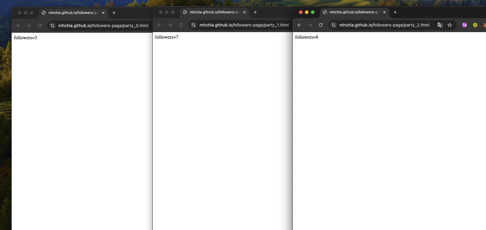
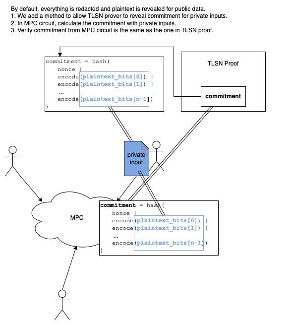

# Authenticating MPC Inputs with TLSNotary

## Table of Contents
- [Introduction](#introduction)
- [Getting Started](#getting-started)
  - [Install and Setup](#install-and-setup)
- [Demonstration](#demonstration)
  - [Run Demo](#run-demo)
- [Implementation Details](#implementation-details)
  - [Challenges and Solutions](#challenges-and-solutions)
  - [Key Components](#key-components)
- [Future Work](#future-work)


## Introduction
Our work offers a solution to a common challenge in Multi-Party Computation (MPC): verifying the authenticity of inputs while preserving their privacy. Traditionally, MPC guarantees input privacy but does not ensure that the inputs are genuine (e.g., they can be arbitrarily provided by parties). By integrating [TLSNotary](https://tlsnotary.org/), we provide a method to authenticate inputs from specific websites without revealing the actual data, thereby enhancing the reliability and trustworthiness of MPC applications. This approach enables new use cases, such as collaborative data analysis, privacy-preserving voting, and other secure multi-party operations with authenticated inputs.

Implemented with [MP-SPDZ](https://github.com/data61/MP-SPDZ), our solution can be easily adapted to other ZKP, MPC, and FHE frameworks to enable private input authentication.

With the installation and demo run instructions provided below, you can quickly set up the project and verify its functionality.

## Getting Started

### Install and Setup
```bash
git clone https://github.com/ZKStats/MP-SPDZ.git
cd MP-SPDZ && git checkout tlsn-integration
make setup && make -j8 semi-party.x
cd .. && git clone https://github.com/ZKStats/tlsn.git
cd tlsn && git checkout mpspdz-compat
```

## Demonstration
This is the ideal flow of our project:
1. Parties generate TLSNotary proofs for their input webpages, only revealing the data commitments of their input.
2. MPC calculates and reveals TLSNotary data commitments from private inputs.
3. Parties verify each other's TLSNotary proofs and check if MPC-calculated commitments match those in the proofs.

In our demonstration, all TLSNotary proofs from the parties are verified by our demo script in a centralized manner, rather than being passed between the parties. This simplification allows us to focus on demonstrating the core concept of input authentication without the complexity of network communication.

### Run Demo
Run the demo to calculate followers from three webpages:
- [party_0](https://mhchia.github.io/followers-page/party_0.html)
- [party_1](https://mhchia.github.io/followers-page/party_1.html)
- [party_2](https://mhchia.github.io/followers-page/party_2.html)



Execute the following command to start the demo. Please make sure you're using python 3.9+.

```bash
cd ../MP-SPDZ
python3 example_with_tlsn.py
```

Expected output:
```bash
TLSN proofs verified successfully and matched with MP-SPDZ output
Average followers: 6
```

## Implementation Details
The diagram below illustrates the process of generating and verifying commitments in both the TLSNotary proof and the MPC circuit. It shows how each party commits to their input privately and verifies the commitments in a privacy-preserving manner.



### Challenges and Solutions

1. **Proving properties of redacted data**: The ZKP feature of TLSNotary is still in development, making it not feasible to prove properties of redacted data as they are not committed in TLSNotary proofs.
   - **Solution:** We added a "commit-and-reveal-commitment" feature to TLSNotary, allowing only commitments (hashes) to be revealed while keeping private inputs confidential. We calculate the same commitment in MP-SPDZ and verify if they match the one in the TLSNotary proof.

2. **Hash function compatibility**: The `blake3` hash function used in TLSNotary is not supported by MP-SPDZ.
   - **Solution:** We replaced `blake3` with `sha3` to ensure compatibility with the hash functions supported by MP-SPDZ.

### Key Components
- **MP-SPDZ Circuit for TLSNotary Data Commitment Generation**: This is where we implemented the data commitment logic using the `sha3` https://github.com/ZKStats/MP-SPDZ/blob/10ea91835ae5321f91d86ff3719fd82bb53bf44c/example_with_tlsn.py#L207-L222
- **Forked TLSNotary Repository**: [TLSNotary with MP-SPDZ compatibility](https://github.com/ZKStats/tlsn/compare/main...mpspdz-compat) - Our modified version of TLSNotary to work seamlessly with MP-SPDZ.


## Future Work
- Make it work with multiple digits inputs.
- Replace example pages with real-world pages, like [the health care page in Taiwan](https://github.com/ZKStats/tlsn/pull/4).
- Improve modularity and portability.
- Reintroduce `blake3` in MP-SPDZ for compatibility with the upstream TLSNotary.
- Utilize TLSNotary's ZKP feature when available.
